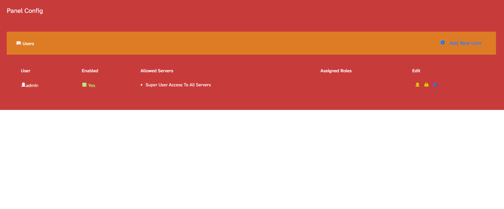

# Instalando o Crafty Controller no GitHub Codespaces

Neste guia, vamos instalar o Crafty Controller dentro de um GitHub Codespace. Ele será usado para criar, configurar e administrar um servidor de Minecraft.

---

## 1. Criar e abrir o Codespace

Depois de criar o repositório no GitHub:

1. Abra o repositório.
2. Clique em **Code**.
3. Entre na aba **Codespaces**.
4. Clique em **Create codespace on main**.
5. Aguarde o ambiente carregar.

Quando o Codespace abrir, utilize o terminal localizado na parte inferior da tela.

---

## 2. Preparar o ambiente

Execute:

```bash
sudo apt update && sudo apt upgrade && sudo apt install git
```

Esse comando atualiza os pacotes do ambiente e instala o Git, necessário para baixar o instalador do Crafty.

Quando o terminal perguntar se deseja continuar, digite:

```text
Y
```

e pressione **Enter**.

### Configuração do OpenSSH

Durante a atualização, poderá aparecer uma tela chamada:

```text
Configuring openssh-server
```

Mantenha selecionada a opção:

```text
keep the local version currently installed
```

Depois, pressione **Enter** para confirmar.

Essa escolha preserva as configurações utilizadas pelo GitHub Codespaces.

---

## 3. Limpar o terminal

Depois que a atualização terminar, execute:

```bash
clear
```

Esse comando apenas limpa visualmente o terminal.

---

## 4. Instalar a dependência `distro`

Execute:

```bash
pip install distro
```

O pacote `distro` ajuda o instalador do Crafty a identificar corretamente o sistema Linux utilizado pelo Codespace.

Caso o instalador apresente o erro:

```text
ModuleNotFoundError: No module named 'distro'
```

execute:

```bash
sudo python3 -m pip install distro --break-system-packages
```

Depois, continue normalmente com a instalação.

---

## 5. Baixar o instalador do Crafty

Execute:

```bash
git clone https://gitlab.com/crafty-controller/crafty-installer-4.0.git
```

Esse comando cria uma pasta chamada:

```text
crafty-installer-4.0
```

com os arquivos necessários para a instalação.

---

## 6. Entrar na pasta do instalador

Execute:

```bash
cd crafty-installer-4.0
```

Agora o terminal estará dentro da pasta que contém o instalador.

---

## 7. Iniciar a instalação

Execute:

```bash
sudo ./install_crafty.sh
```

O instalador começará a preparar o Crafty Controller e fará algumas perguntas.

---

## 8. Confirmar o Ubuntu

Quando aparecer uma pergunta semelhante a:

```text
Would you like to continue installing Crafty on Ubuntu?
```

digite:

```text
Y
```

e pressione **Enter**.

O instalador está confirmando que deve continuar utilizando as configurações compatíveis com Ubuntu.

---

## 9. Recusar o diretório padrão

Quando aparecer:

```text
Install Crafty to this directory? /var/opt/minecraft/crafty - ['y', 'n']:
```

digite:

```text
N
```

e pressione **Enter**.

Vamos instalar o Crafty dentro da pasta do próprio Codespace, facilitando o acesso aos arquivos.

---

## 10. Escolher a pasta de instalação

O instalador perguntará em qual diretório o Crafty deve ser instalado.

No explorador de arquivos do Codespace:

1. Localize o arquivo `README.md`.
2. Clique nele com o botão direito.
3. Selecione **Copy Path** ou **Copiar Caminho**.
4. Cole o caminho no terminal.

O caminho deverá ser parecido com:

```text
/workspaces/nome-do-repositorio/README.md
```

Apague somente:

```text
README.md
```

e substitua por:

```text
Minecraft
```

O resultado deverá ficar parecido com:

```text
/workspaces/nome-do-repositorio/Minecraft
```

Pressione **Enter**.

O nome do repositório será diferente para cada pessoa.

---

## 11. Escolher a branch do Crafty

Quando aparecer:

```text
Which branch of Crafty would you like to run? - ['master', 'dev']: master
```

Mantenha:

```text
master
```

e pressione **Enter**.

A opção `master` é a versão recomendada para este tutorial.

---

## 12. Não criar um arquivo de serviço

Quando aparecer:

```text
Would you like to make a service file for Crafty? - ['y', 'n']:
```

digite:

```text
N
```

e pressione **Enter**.

No GitHub Codespaces, iniciaremos o Crafty manualmente sempre que o ambiente for aberto.

---

## 13. Iniciar o Crafty Controller

Depois que a instalação terminar, execute o arquivo `run_crafty.sh`.

O comando terá este formato:

```bash
/workspaces/nome-do-repositorio/Minecraft/run_crafty.sh
```

Exemplo:

```bash
/workspaces/minecraft-fabric-server-codespaces/Minecraft/run_crafty.sh
```

Substitua:

```text
minecraft-fabric-server-codespaces
```

pelo nome exato do seu repositório.

Uma forma mais simples de encontrar o caminho correto é:

1. Abra a pasta `Minecraft`.
2. Localize o arquivo `run_crafty.sh`.
3. Clique nele com o botão direito.
4. Selecione **Copy Path**.
5. Cole o caminho no terminal.
6. Pressione **Enter**.

O Linux diferencia letras maiúsculas e minúsculas. Portanto, `Minecraft` e `minecraft` são nomes diferentes.

---

## 14. Abrir o painel no navegador

Com o Crafty em execução:

1. Abra a aba **Portas** ou **Ports** no Codespace.
2. Localize a porta utilizada pelo Crafty.
3. Clique no endereço exibido na coluna de endereço encaminhado.
4. O painel será aberto em uma nova aba do navegador.

O GitHub Codespaces cria um endereço temporário para permitir o acesso ao painel executado dentro do ambiente remoto.

Não feche o terminal em que o Crafty está rodando. Ao interromper o processo, o painel também será desligado.

---

# Primeiro acesso ao Crafty Controller

## 15. Localizar as credenciais iniciais

Ao abrir o painel, você será direcionado para a tela de login.

Clique em:

```text
Forgot Password
```

ou:

```text
Esqueci a senha
```

Depois, volte ao terminal em que o Crafty está sendo executado.

O terminal mostrará as credenciais iniciais:

```text
Username
Password
```

Copie o nome de usuário e a senha exibidos e utilize-os para entrar no painel.

> Não publique prints do terminal que mostrem suas credenciais.

---

## 16. Alterar a senha do administrador

Depois do primeiro login, você será direcionado para a tela **Panel Config**.

Na linha do usuário:

```text
admin
```

localize o ícone de cadeado na coluna **Edit** e clique nele.



Em seguida:

1. Digite uma nova senha.
2. Confirme a nova senha.
3. Salve a alteração.

Escolha uma senha forte e não a compartilhe no repositório, em prints ou em vídeos.

Para utilizar a imagem no tutorial, salve a captura dentro do repositório com esta estrutura:

```text
images/
└── crafty-alterar-senha.png
```

---

## 17. Testar a nova senha

Depois de salvar a alteração:

1. Clique no ícone do usuário no canto superior direito.
2. Selecione **Logout**.
3. Na tela de login, informe:

```text
Username: admin
```

4. Digite a nova senha.
5. Clique em **Login**.

Se o acesso funcionar, a nova senha foi salva corretamente e o primeiro acesso ao Crafty Controller está concluído.

---

# Resumo dos comandos

```bash
sudo apt update && sudo apt upgrade && sudo apt install git
```

```bash
clear
```

```bash
pip install distro
```

```bash
git clone https://gitlab.com/crafty-controller/crafty-installer-4.0.git
```

```bash
cd crafty-installer-4.0
```

```bash
sudo ./install_crafty.sh
```

Depois da instalação:

```bash
/workspaces/nome-do-repositorio/Minecraft/run_crafty.sh
```

Caso apareça o erro relacionado ao módulo `distro`:

```bash
sudo python3 -m pip install distro --break-system-packages
```

---

# Resumo das respostas do instalador

| Pergunta                                | Resposta                                    |
| --------------------------------------- | ------------------------------------------- |
| Continuar a instalação no Ubuntu        | `Y`                                         |
| Instalar em `/var/opt/minecraft/crafty` | `N`                                         |
| Diretório de instalação                 | `/workspaces/nome-do-repositorio/Minecraft` |
| Branch do Crafty                        | `master`                                    |
| Criar arquivo de serviço                | `N`                                         |

Com isso, o Crafty Controller estará instalado, iniciado, protegido por uma nova senha e acessível pelo navegador.
